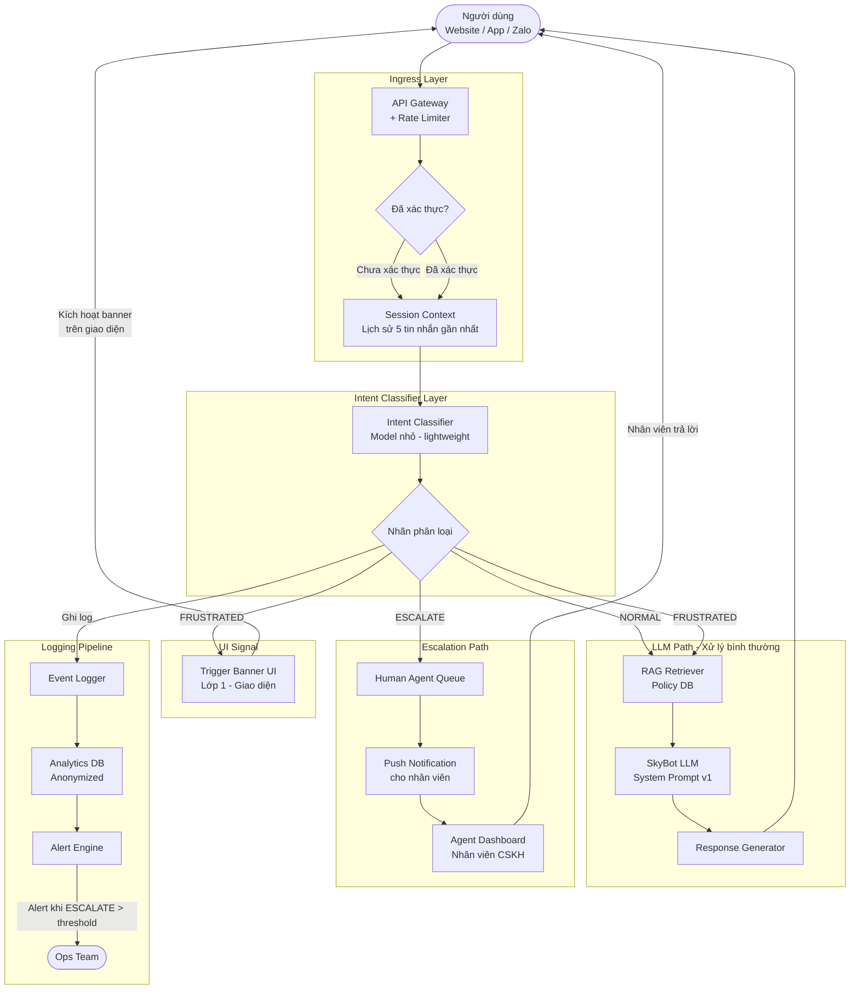
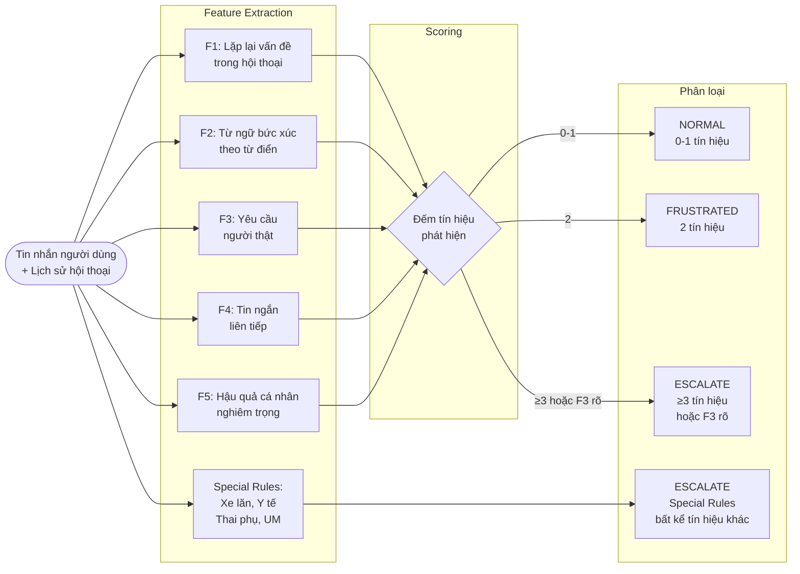
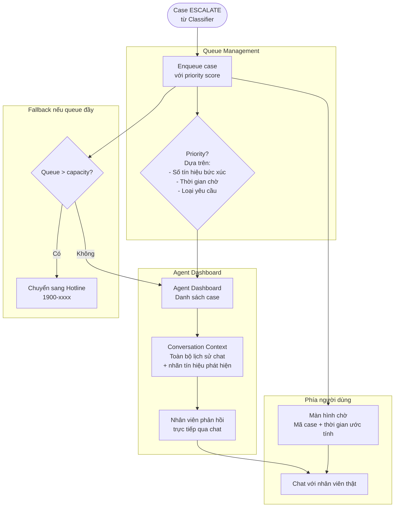
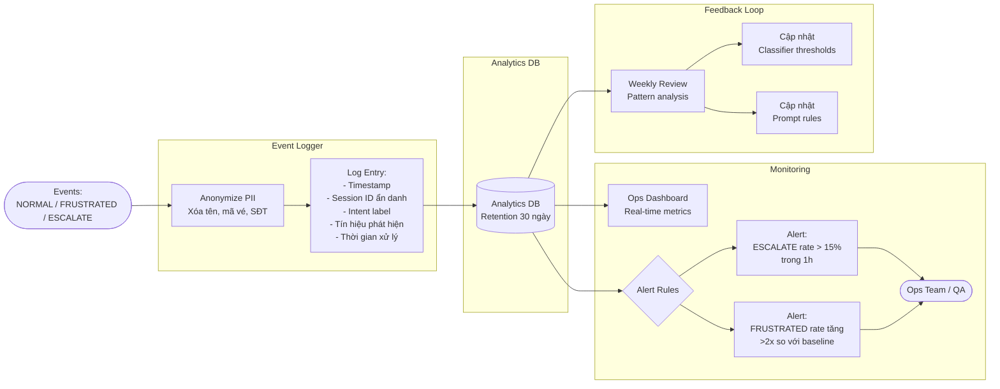

# demo.md — Kiến trúc SkyBot v1

Sơ đồ kiến trúc luồng xử lý trọng tâm vào giải pháp escalation failure (T-03).

---

## 1. Main Pipeline — Luồng xử lý chính

---

## 2. Intent Classifier — Chi tiết phân loại

---

## 3. Human Agent Queue — Luồng nhân viên tiếp nhận

---

## 4. Logging & Monitoring Pipeline

---

## 5. Bảng Routing — Tóm tắt

| Nhãn classifier | Điều kiện | LLM xử lý? | UI thay đổi? | Nhân viên? | Log? |
|---|---|---|---|---|---|
| NORMAL | 0-1 tín hiệu | Có | Không | Không | Có (metadata) |
| FRUSTRATED | 2 tín hiệu | Có | Banner cam xuất hiện | Không (chưa) | Có (đầy đủ) |
| ESCALATE | ≥3 tín hiệu / F3 rõ / Special | Không | Banner đỏ + chuyển | Có, ngay lập tức | Có (đầy đủ + priority) |

---

## 6. Data Sources cho RAG (T-07, T-09)

| Nguồn | Loại dữ liệu | Tần suất cập nhật | Dùng cho |
|---|---|---|---|
| Policy DB chính thức | Chính sách vé, hành lý, đổi/hoàn | Cập nhật khi hãng thay đổi chính sách | T-07 (đổi vé), T-08 (Thông tư 14) |
| Flight DB | Trạng thái chuyến bay, lịch bay | Real-time sync từ hệ thống hãng | T-01 (delay), T-04 |
| Special Assistance Rules | Quy định hỗ trợ đặc biệt | Cập nhật theo IATA / Cục HKVN | T-05 (xe lăn), T-09 (trẻ em) |
| Security Rules | Quy định an ninh cabin (chất lỏng, v.v.) | Theo IATA / Bộ GTVT VN | T-07 (hành lý) |

Quy tắc xử lý khi RAG thiếu dữ liệu:
- Nếu Policy DB không có dữ liệu cho câu hỏi → SkyBot KHÔNG tự đoán → trả lời "Tôi chưa có thông tin chính xác về vấn đề này, để tôi kết nối bạn với nhân viên hoặc dẫn bạn đến trang chính sách chính thức."
- Nếu Flight DB offline → không cung cấp thông tin trạng thái chuyến → thông báo và hướng sang hotline

---

## 7. Kiểm tra nhanh

- [x] Sơ đồ cho thấy dữ liệu đi từ User → Classifier → Router → LLM / Human Queue.
- [x] Có bước kiểm tra intent trước khi AI trả lời (Classifier là bước đó).
- [x] Có cách xử lý khi phân loại ESCALATE (Human Agent Queue).
- [x] Có cách biết lỗi có đang lặp lại không (Logging + Alert Engine).
- [x] 3 lớp phối hợp rõ ràng: Classifier → trigger Lớp 1 banner + cho Lớp 2 prompt xử lý.
